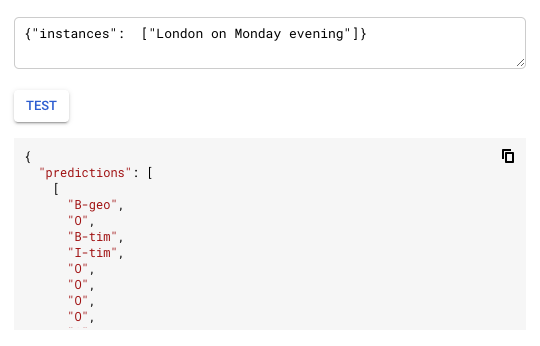

# Named Entity Recognition with Kubeflow and Keras 

In this walkthrough, you will learn how to use Kubeflow to build reusable components to train your model on an kubernetes cluster and deploy it to AI platform.

## Goals

* Demonstrate how to build reusable pipeline components
* Demonstrate how to use Keras only models
* Demonstrate how to train a Named Entity Recognition model on a Kubernetes cluster
* Demonstrate how to deploy a Keras model to AI Platform
* Demonstrate how to use a custom prediction routine
* Demonstrate how to use Kubeflow metrics
* Demonstrate how to use Kubeflow visualizations 

## What is Named Entity Recognition
Named Entity Recognition is a word classification problem, which extract data called entities from text.



# Intern Detalis

``` bash
Name: Omeh Chukwuemeka
Student_ID:c01e2e
Stage: D
Stage Lesson: Setting up Kubernetes using Microk8s.
Task Target: Deploy Kubeflow 
```
```
# Task Name: Named Entity Recognition with Kubeflow and Keras 

In this walkthrough, you will learn how to use Kubeflow to build reusable components to train your model on an kubernetes cluster and deploy it to AI platform.

## Task Goals/Aim

1. Demonstrate how to build reusable pipeline components
2. Demonstrate how to use Keras only models
3. Demonstrate how to train a Named Entity Recognition model on a Kubernetes cluster
4. Demonstrate how to deploy a Keras model to AI Platform
5. Demonstrate how to use a custom prediction routine
6. Demonstrate how to use Kubeflow metrics
7. Demonstrate how to use Kubeflow visualizations

## What is Named Entity Recognition
Named Entity Recognition is a word classification problem, which extract data called entities from text.


### Steps

1. [Setup Kubeflow and clone repository](documentation/step-1-setup.md)
1. [Build the pipeline components](documentation/step-2-build-components.md)
1. [Upload the dataset](documentation/step-3-upload-dataset.md)
1. [Custom prediction routine](documentation/step-4-custom-prediction-routine.md)
1. [Run the pipeline](documentation/step-5-run-pipeline.md)
1. [Monitor the training](documentation/step-6-monitor-training.md)
1. [Predict](documentation/step-7-predictions.md)

# Task Documentation link: "https://github.com/kubeflow/examples/tree/master/named_entity_recognition"


  ```bash

# Task Problem Statement
Machine Learning process is such an iterative process. By this we mean that Machine Learning work cycle is recycling in nature. As a result, most often Machine Learning Engineers need to automate this work flow process to make it easy and reuseable.

To achieve this, there comes the principle of building  workflow pipeline. An ordinary Machine Learning or Data Scientist may not be able to do this because he or she was trained o do so. Therefore, there is a need for Data Engineer and MLOps to build, compile and run a reuseable pipeline that everyone in the team can use at anytime.

In this project, the target is to build a pipeline for preprocess Machine learning, training and deployment. 


# Step 1: Setting up of Kubeflow and cloning of task repository

### Deploying Kubeflow to Google Cloud Platform
In this task, i deployed kubeflow to Google Cloud Platform using the Command Line(CLI) approach. This is because this approach gives me the ability to run command direct from the terminal and it gives one the authority to understand and also see scripts/commands and know how they work and function. The documentations on how to setup a Kubeflow environment by using the [Command Line Approach](https://www.kubeflow.org/docs/gke/deploy/deploy-cli/).

### Set environment variables

Create the following environment variables, follow the [documenation](https://cloud.google.com/resource-manager/docs/creating-managing-projects#identifying_projects) to get the project id :

```bash
export BUCKET=chris-bucket
export PROJECT_ID=hamoye-kubeflow1
```

## Create bucket
Creating a bucket that will contain everything required for our Kubeflow pipeline. My bucket region is US-CENTRAL1. The below bash command will create a google cloud storage bucket for our file storage.

```bash
gsutil mb -c regional -l us-central1 gs://${BUCKET}
```
```
## Cloning the examples repository
The Cloned repository contains everything needed for this example. The clone repo is from kubeflow examples

```bash
git clone https://github.com/kubeflow/examples.git
```
```
Next is to open a Terminal and navigate to the folder `/examples/named_entity_recognition/` which is in the cloned repository.

# Step 2: Build the pipeline components

### Build components

A component is code that performs one step in the Kubeflow pipeline. It is a containerized implementation of an ML task. **Components can be reused in other pipelines.**

### Component structure
A component follows a specific structure and contains some configuartion files.The summary steps of kubeflow componenents structure is:

1. Write the program that contains your component’s logic. The program must use files and     command-line arguments to pass data to and from the component.
2. Containerize the program.
3. Write a component specification in YAML format that describes the component for the Kubeflow Pipelines system.
4. Use the Kubeflow Pipelines SDK to load your component, use it in a pipeline and run that pipeline.
The configuration files includes:
 
* `/src` - Component logic . 
* `component.yaml` - Component specification. 
* `Dockerfile` - Dockerfile to build the container. 
* `readme.md` - Readme to explain the component and its inputs and outputs. 
* `build_image.sh` - Scripts to build the component and push it to a Docker repository. 

## Components
This Kubeflow project contains 3 components:

### Preprocess component
The preprocess component is downloading the training data and performs several preprocessing steps. This preprocessing step is required in order to have data which can be used by our model. 


### Train component
The train component is using the preprocessed training data. Contains the model itself and manages the training process. 

### Deploy component
The deploy component is using the model and starts a deployment to AI Platform. 

## Build and push component images
In order to use the components later on in our pipelines,you have to build and then push the image to a Docker registry. In this example, you are using the 
[Google Container Registry](https://cloud.google.com/container-registry/), it is possible to use any other docker registry. 

Each component has its dedicated build script `build_image.sh`, the build scripts are located in each component folder:

* `/components/preprocess/build_image.sh`
* `/components/train/build_image.sh`
* `/components/deploy/build_image.sh`

To build and push the Docker images open a Terminal, navigate to `/components/` and run the following command:

```bash
$ ./build_components.sh
```


## Check that the images are successfully pushed to the Google Cloud Repository

Navigate to the Google Cloud Container Registry and validate that you see the components. 


## Upload the component specification
The specification contains anything you need to use the component. Therefore you need access to these files later on in your pipeline. 
It also contains the path to our docker images, open `component.yaml` for each component and set **`<PROJECT-ID>`** to your Google Cloud Platform project id.

Upload all three component specifications to your Google Cloud Storage and make it public accessible by setting the permission to `allUsers`.

> It is also possible to upload those files to a storage solution of your choice. GCS currently only supports public object in the GCS.

Navigate to the components folder `/components/` open `copy_specification.sh` set your bucket name `BUCKET="your-bucket"` and run the following command:

```bash
$ ./copy_specification.sh
```
# STEP 3
```bash
$ ./build_components.sh
```

## Check that the images are successfully pushed to the Google Cloud Repository

Navigate to the Google Cloud Container Registry and validate that you see the components. 


## Upload the component specification
The specification contains anything you need to use the component. Therefore you need access to these files later on in your pipeline. 
It also contains the path to our docker images, open `component.yaml` for each component and set **`<PROJECT-ID>`** to your Google Cloud Platform project id.

Upload all three component specifications to your Google Cloud Storage and make it public accessible by setting the permission to `allUsers`.

> It is also possible to upload those files to a storage solution of your choice. GCS currently only supports public object in the GCS.

Navigate to the components folder `/components/` open `copy_specification.sh` set your bucket name `BUCKET="your-bucket"` and run the following command:

```bash
$ ./copy_specification.sh
```

The bucket contains 3 folder:


## Troubleshooting
Run `gcloud auth configure-docker` to configure docker, in case you get the following error message:

```b
You don't have the needed permissions to perform this operation, and you may have invalid credentials. To authenticate your request, follow the steps in: https://cloud.google.com/container-registry/docs/advanced-authentication
```

# STEP 4
# Dataset

## Dataset description

This example project is using the popular CoNLL 2002 dataset. The csv consists of multiple rows each containing a word with the corresponding tag. Multiple rows are building a single sentence. 

The dataset itself contains different tags
* geo = Geographical Entity 
* org = Organization 
* per = Person 
* gpe = Geopolitical Entity 
* tim = Time indicator 
* art = Artifact 
* eve = Event 
* nat = Natural Phenomenon

Each tag is defined in an IOB format, IOB (short for inside, outside, beginning) is a common tagging format for tagging tokens.

> B - indicates the beginning of a token

> I - indicates the inside of a token

> O - indicates that the token is outside of any entity not annotated

### Example

```bash
"London on Monday evening"
"London(B-geo) on(O) Monday(B-tim) evening(I-tim)"
```

## Data Preparation
You can download the dataset from the [Kaggle dataset](https://www.kaggle.com/abhinavwalia95/entity-annotated-corpus). In order to make it convenient we have uploaded the dataset on GCS.

```
gs://kubeflow-examples-data/named_entity_recognition_dataset/ner.csv
```

> The training pipeline will use this data, there are no further data preperation steps required.

# STEP 5
# Custom prediction routine

Custom prediction routines allow us to specify additional code that runs with every prediction request.
Without custom prediction routine the machine learning framework handles the prediction operation.

## Why custom prediction routine
Our model requires numeric inputs, which we convert from text before training (this is the preprocessing step). To perform the same conversion at prediction time, inject the preprocessing code by defining a custom prediction routine.

> Without a custom prediction routine, you would need to create a wrapper, e.g. with App Engine or Cloud Functions, which would add complexity and latency.

## How do custom prediction routines work?

Our custom prediction routine requires six parts

* `keras_saved_model.h5` - The model stored as part of our training component (artifact).
* `processor_state.pkl` - The preprocessing state stored as part of our training component (artifact).
* `model_prediction.py` - The custom prediction routine logic.
* `text_preprocessor.py` - The pre-processing logic.  
* `custom_prediction_routine.tar.gz` - A Python package `tar.gz` which contains our implementation.
* `setup.py` - Used to create the Python package. 

To build our custom prediction routine run the build script located `/routine/build_routine.sh`. This creates a `tar.gz` which is required when you deploy your model. 

Navigate to the routine folder `/routine/` and run the following build script:

```bash
$ ./build_routine.sh
```

## Upload custom prediction routine to Google Cloud Storage

```bash
gsutil cp custom_prediction_routine-0.2.tar.gz gs://${BUCKET}/routine/custom_prediction_routine-0.2.tar.gz
```
# STEP 6

### Steps

1. [Setup Kubeflow and clone repository](documentation/step-1-setup.md)
1. [Build the pipeline components](documentation/step-2-build-components.md)
1. [Upload the dataset](documentation/step-3-upload-dataset.md)
1. [Custom prediction routine](documentation/step-4-custom-prediction-routine.md)
1. [Run the pipeline](documentation/step-5-run-pipeline.md)
1. [Monitor the training](documentation/step-6-monitor-training.md)
1. [Predict](documentation/step-7-predictions.md)


